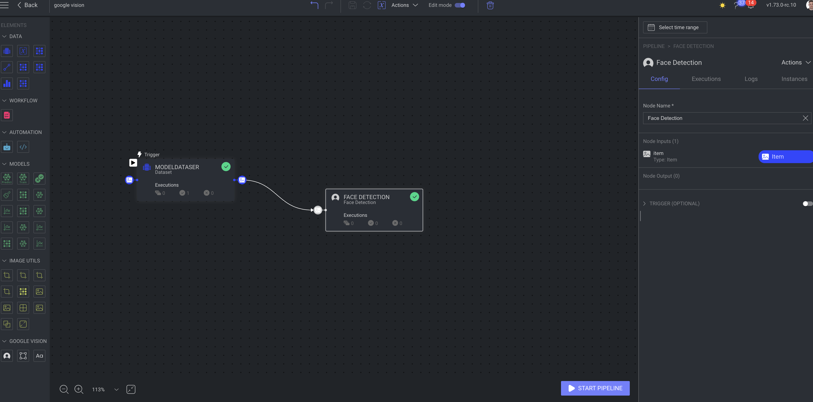

  

## Pipeline library application for Google Vision Functions

---

  
  

---

## Description

Application for the Dataloop custom Pipeline nodes feature.

The Application allows access to more pipeline nodes that can be used in the pipeline.

The application gives a variety of nodes created from Google Vision Functions, where every function is separate node. List of the nodes:

- [detect crop hints](google_vision/crop_hint/crop_hint.py)
- [explicit content detection](google_vision/explicit_content_detection/explicit_content_detection.py)
- [face detection](google_vision/face_detection/face_detection.py)
- [label detection](google_vision/label_detection/label_detection.py)
- [logo detection](google_vision/logo_detection/logo_detection.py)
- [object detection](google_vision/object_detection/object_detection.py)
- [text detection](google_vision/text_detection/text_detection.py)
- [web entities and pages detection](google_vision/web_entities_and_pages/web_entities_and_pages.py)

## Installations

- Clone the repository

- Publishing the app:

`dlp app publish --project-name "<PROJECT_NAME>"`

- To install for a project:

`dlp app install --dpk-id "<DPK ID>" --project-name "<PROJECT_NAME>"`

## UI Usage:

  

## Add secrets and add them to pipeline node

Init parameter have to have same name as secrets name.

