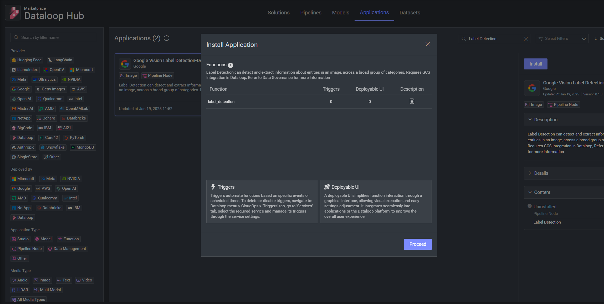
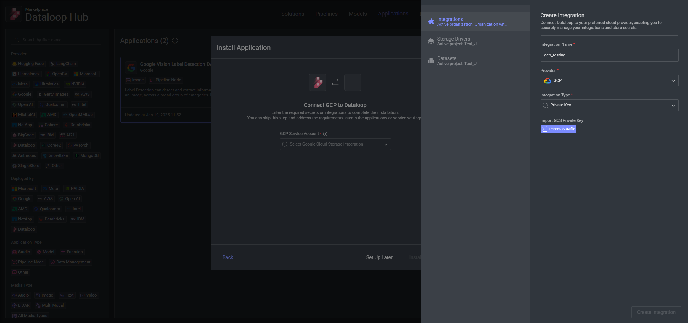
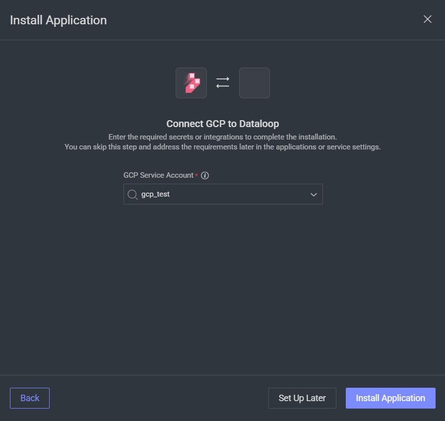
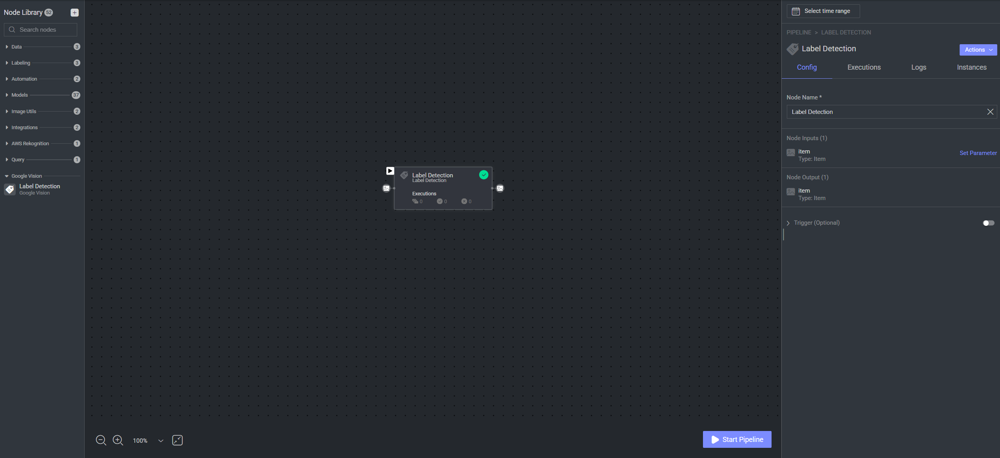

# Google Vision Adapter

This repository provides an integration between **Dataloop** and the **Google Vision** API.

---

## Overview

- **Purpose**  
  Acts as an adapter that allows images or other media to be sent to the Google Vision API for analysis, inside a Dataloop pipeline node. It then returns structured results, such as labels, bounding boxes, recognized text, and more.

- **Technology Stack**  
  - **Python**
  - **Google Cloud Vision**

---

## Google Vision Functions Used

Below is a list of the main Google Vision detection nodes:

1. **Text Detection**  
   *Detects and extracts text from an image. Returns the recognized text along with bounding boxes for each piece of identified text.*

2. **Label Detection**  
   *Detects and extracts information about entities in an image, across a broad group of categories. Returns different labels found.*

3. **Face Detection**  
   *Detects human faces within an image. Returns bounding boxes for each face and can include additional attributes (e.g., likelihood of joy, sorrow, anger, and surprise).*

4. **Logo Detection**  
   *Identifies logos from well-known brands within the image. Returns bounding boxes and the corresponding brand names for each detected logo.*

5. **Object Detection**  
   *Performs object localization, returning bounding boxes and classification labels for each recognized object in the image.*

6. **Explicit Content Detection**  
   *Evaluates the image for explicit or sensitive content (e.g., adult, racy, violence). Returns labels of explicit content found.*

7. **Web Detection**  
   *Detects and add to metadata web entities and pages found within an image.*

8. **Crop Hints**  
   *Handles image cropping using Google Vision crop hints. Return cropped image.*

---
## Setting Up Your GCP Project

To use these nodes, you need a Google Cloud Platform (GCP) project. Follow these steps to get started:

### 1. Enable the Cloud Vision AI API
   - Navigate to the [Cloud Vision API](https://console.developers.google.com/apis/api/vision.googleapis.com) in the GCP Console.
   - Enable the Cloud Vision AI API.

### 2. Create a GCP [Service Account](https://docs.dataloop.ai/docs/private-key-integration?highlight=create%20service%20account)
   - Go to the IAM & Admin section in the GCP Console.
   - Create a new service account.
   - Generate a new key and download the service account JSON file.

## Integrating Google Cloud Vision AI API with Dataloop Platform

   - Visit the [Dataloop Marketplace](https://docs.dataloop.ai/docs/marketplace), under Applications tab.
   - Select the application and click on "Install" and then "Proceed".

   - Select an existing GCP integration or add a new one by importing the JSON file you previously downloaded.

   - Install the application.

## Use the application in a pipeline
   - After installing the application, you can use the relevant node in a pipeline under the category 'GoogleVision'.

---

For additional assistance or inquiries, please refer to the Dataloop documentation or contact support.